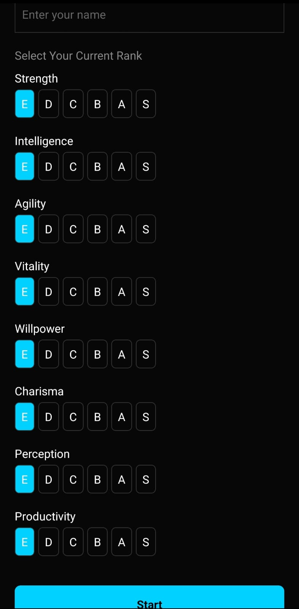

# ⚔️ ARISE — Gamified Self-Improvement System

ARISE is a mobile application that models personal growth as a structured RPG-style progression system.

---

## 🚀 Features
- Multi-attribute stat system with rank + XP
- Dynamic task generation based on weakest stats
- Rank-lock mechanism enforcing balanced growth
- Daily reset and streak system
- Fully offline-first architecture

---

## 📸 Screenshots


---

## 🛠 Tech Stack
- React Native
- AsyncStorage
- JavaScript

---

## ⚙️ Run Locally

```bash
git clone https://github.com/VenkateshPanda0/arise.git
cd arise
npm install
npx react-native run-android
```

---

## 🎯 Concept
This app focuses on discipline-driven progression using constraints rather than flexibility.
